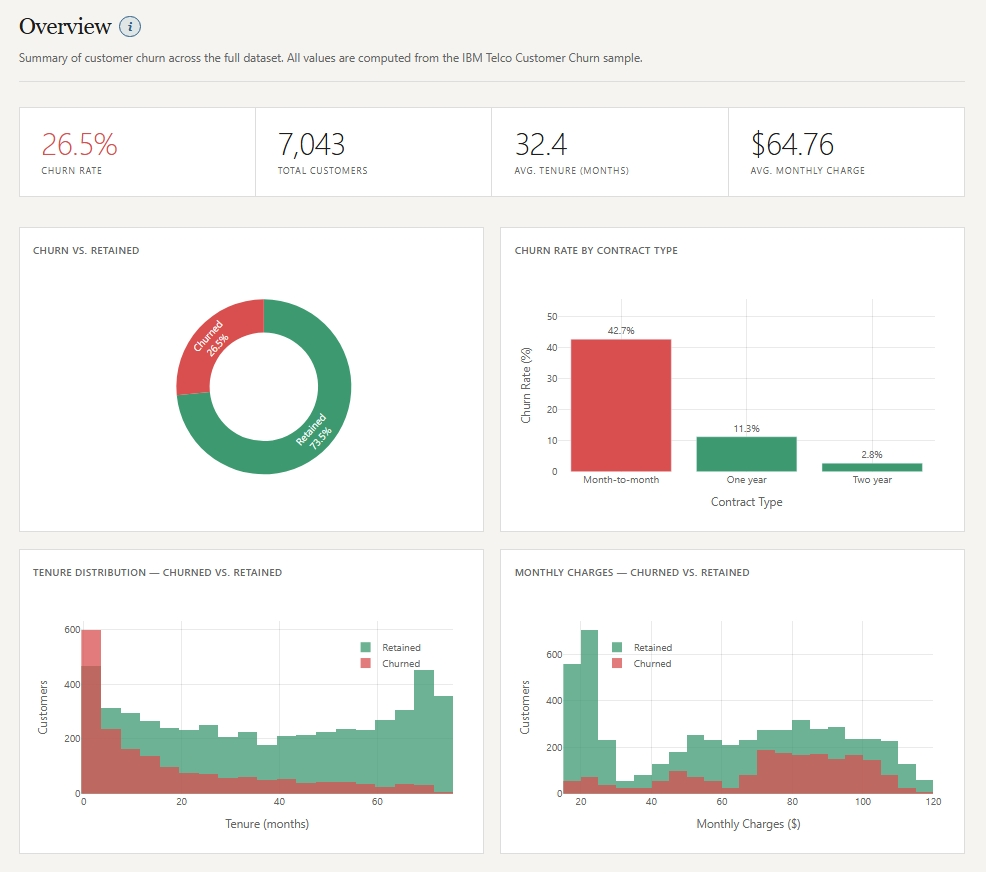
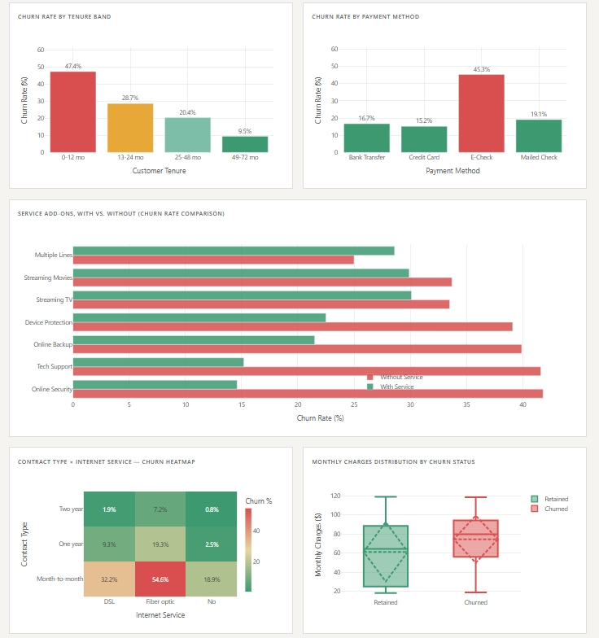
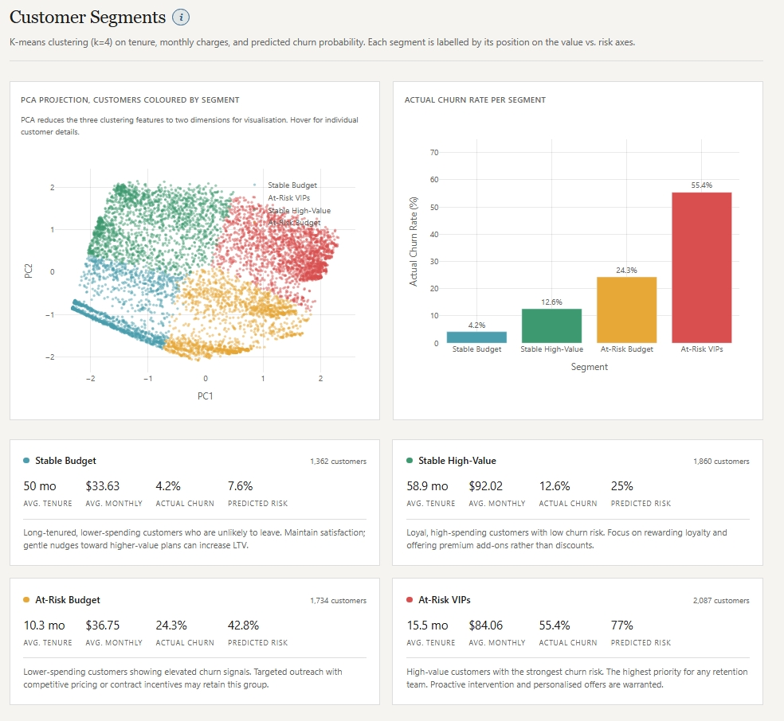

# Customer Churn Analysis & Retention Modeling

**Live Application:** [https://customer-churn-analysis-one.vercel.app/](https://customer-churn-analysis-one.vercel.app/)

Interactive analysis of telecom customer churn built on the IBM Telco Customer Churn dataset (7,043 customer records). Exploratory data analysis, statistical driver identification, logistic regression churn prediction, and k-means customer segmentation, all visualised in a clean five-page web application deployed on Vercel.

---

## Application Preview

| Overview Dashboard | Live Churn Predictor |
|---|---|
|  |  |

| Churn Drivers & Heatmap | Customer Risk Segments |
|---|---|
|  |  |

---

## What This Solves

Retention teams need to understand who is at risk of leaving and why. This project provides actionable answers:

- **Who**: a live interactive predictor calculates instant churn probability for any customer profile
- **Why**: statistical analysis identifies which contract types, tenure bands, and services drive churn
- **How to act**: k-means clustering groups customers into four actionable retention segments

---

## Tech Stack

| Layer | Technologies Used |
|---|---|
| Data & Analytics | Python, pandas, scikit-learn, scipy |
| Visualisation | Plotly (interactive charts) |
| Web Application | HTML, Vanilla CSS (custom properties), JavaScript |
| Deployment | Vercel (static hosting, zero server latency) |

---

## Architecture

```
WA_Fn-UseC_-Telco-Customer-Churn.csv
        │
        ▼
analysis/run_analysis.py   (runs locally)
        │
        ├─► public/data/kpis.json
        ├─► public/data/*.json          (Plotly chart specs)
        ├─► public/data/model_coefficients.json
        └─► public/data/segments_profiles.json
        │
        ▼
Static HTML/CSS/JS (public/)  →  Vercel
```

---

## Key Analytics Findings

| Metric / Driver | Analytical Result |
|---|---|
| Overall Churn Rate | **26.5%** (1,869 out of 7,043 customers) |
| Month-to-Month Contract Churn | **42.7%** (highest risk contract group) |
| Two-Year Contract Churn | **2.8%** (highest retention group) |
| Online Security Association | Lack of security add-on strongly associated with churn (χ²=850.0, p<0.001) |
| Tech Support Association | Lack of tech support strongly associated with churn (χ²=828.2, p<0.001) |
| Tenure Correlation | Point-biserial **r = -0.352** (longer tenure strongly correlates with retention) |
| Monthly Charges Correlation | Point-biserial **r = +0.193** (higher bills correlate with elevated churn) |
| Data Cleaning Note | 11 missing `TotalCharges` entries (new customers with tenure=0) set to $0 |
| Logistic Regression ROC-AUC | **0.8414** |
| Logistic Regression Recall | **0.7861** |
| Logistic Regression F1 Score | **0.6164** |

### Customer Segments (K-Means, k=4)

| Segment Name | Size | Avg Tenure | Avg Monthly | Actual Churn Rate | Recommended Strategy |
|---|---|---|---|---|---|
| **Stable Budget** | 1,362 | 50.0 mo | $33.63 | 4.2% | Maintain satisfaction; gentle nudges toward higher value plans |
| **Stable High-Value** | 1,860 | 58.9 mo | $92.02 | 12.6% | Reward loyalty and offer premium add-ons |
| **At-Risk Budget** | 1,734 | 10.3 mo | $36.75 | 24.3% | Targeted outreach with competitive pricing or contract incentives |
| **At-Risk VIPs** | 2,087 | 15.5 mo | $84.06 | **55.4%** | Proactive retention team intervention and custom offers |

---

## Pages in the Application

1. **Overview**: Headline KPIs, churn donut split, contract type comparison, tenure and monthly charges histograms.
2. **Churn Drivers**: Chi-square and correlation findings panel, payment method breakdown, service add-on comparisons, contract x internet service heatmap.
3. **Prediction Tool**: Live input form running in-browser logistic regression inference with real-time probability calculation and feature contribution breakdown.
4. **Model Performance**: Confusion matrix, ROC curve, precision-recall curve, feature importance rankings, and transparent model limitations.
5. **Customer Segments**: 2D PCA cluster projection, segment churn rate comparison, and detailed segment profile cards.

---

## Methodology & Design Choices

- **Missing Data Handling**: `TotalCharges` contains whitespace for customers with `tenure=0`. Coerced to numeric and set to 0.
- **Model Choice**: Logistic regression with `class_weight='balanced'` to handle the 26.5% minority class ratio. Stratified 80/20 train-test split.
- **Client-Side Inference**: Model weights, intercept, and scaler parameters are exported to JSON. The prediction tool runs standardisation and sigmoid evaluation directly in JavaScript, eliminating API roundtrips.

---

## Local Setup Instructions

```bash
# Clone the repository
git clone https://github.com/rishi-msrit/customer-churn-analysis.git
cd customer-churn-analysis

# Install Python requirements
pip install -r analysis/requirements.txt

# Run the analysis pipeline (generates JSON artifacts in public/data/)
python analysis/run_analysis.py

# Launch local server
npx serve public
# Open http://localhost:3000
```
